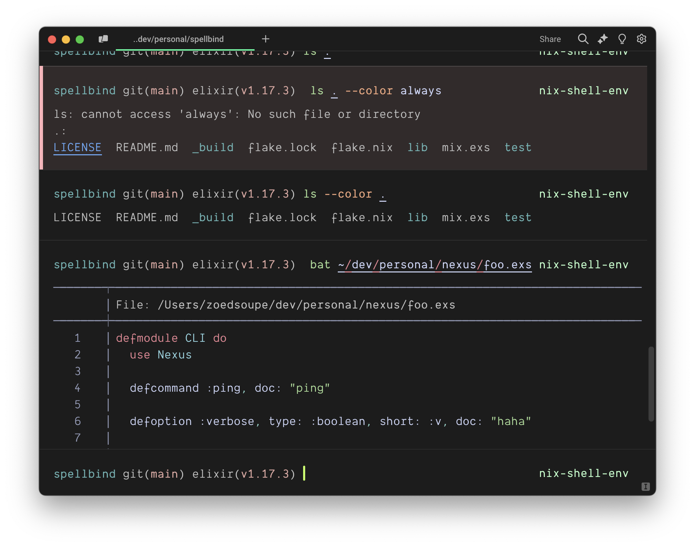

# darkvoid (warp)

## Configuration

place the `darkvoid.yaml` file to your warp themes folder, generally `$XDG_HOME/.warp/themes`.

then you can select the "Dark Void" theme into the "Appearence -> Themes" section of Warp terminal config

be darky and happy (:

## Thanks

- [darkvoid.nvim](https://github.com/Aliqyan-21/darkvoid.nvim)

## License

darkvoid is licensed under the MIT License.
